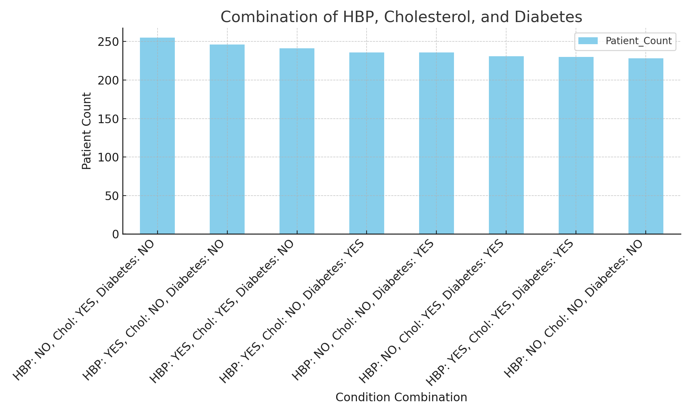
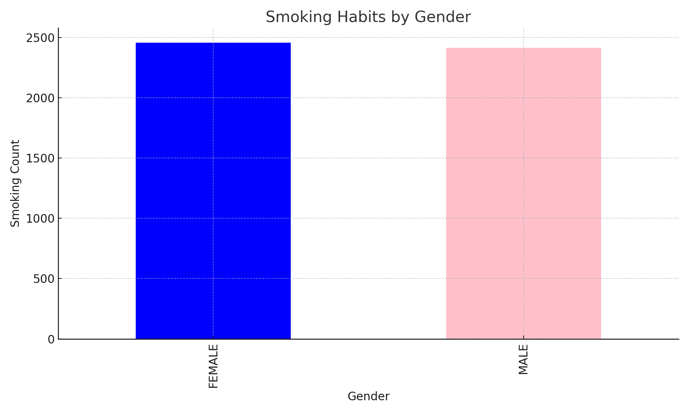
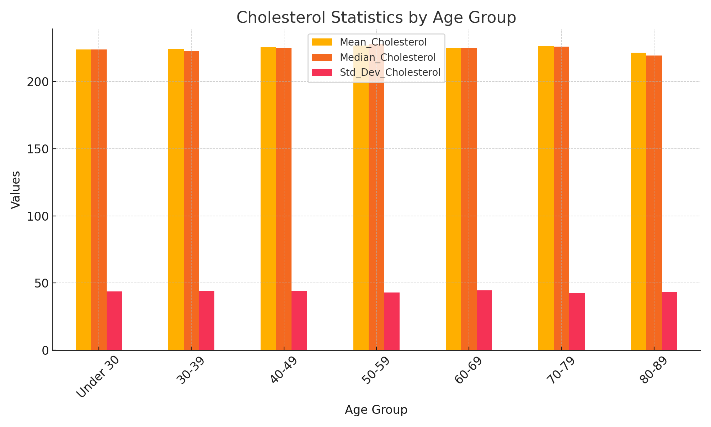

# Heart Disease Analysis

## Tools and Technologies
- **SQL**: Querying and transforming raw data.
- **Excel**: Summarizing and analyzing results.
- **Python**: Data cleaning and further analysis (future enhancements planned).
- **Power BI**: Visualization of findings (not included in this repository).

## Key Skills Demonstrated
- Data querying and aggregation with SQL.
- Data cleaning and preparation for analysis.
- Deriving actionable insights from raw data.
- Presentation of results in a clear, concise format.

## Repository Structure
- **SQL Files**: Located in the root directory and named descriptively.
- **Results Files**: Corresponding `.csv` files containing query outputs.
- **Cleaned Dataset**: Processed files ready for analysis.

## Future Work
- Enhance visual storytelling with Power BI dashboards.
- Expand analyses to include Python scripts for advanced statistical techniques.

## About Me
I am an experienced data analyst transitioning from a background in Olympic weightlifting and CrossFit coaching. I have completed the Google Data Analytics and Maven Analytics certificates, with expertise in SQL, Excel, and data visualization tools.

## Projects

### 1. **Cholesterol Levels by Age and Gender**
- **SQL Query**: [`Cholesterol by Age:Gender.sql`](./Cholesterol%20by%20Age%3AGender.sql)
- **Results**: [`CholesterolByAge&GenderResults.csv`](./CholesterolByAge%26GenderResults.csv)
- **Visualization**: 
- **Description**: This project explores cholesterol trends by age group and gender, providing insights into population health metrics.

### 2. **Impact of Exercise on Health Metrics**
- **SQL Query**: [`ExerciseImpact.sql`](./ExerciseImpact.sql)
- **Results**: [`ExerciseImpactResult.csv`](./ExerciseImpactResult.csv)
- **Visualization**: 
- **Description**: Analyzes the correlation between exercise frequency and key health indicators such as blood pressure, cholesterol, and BMI.

### 3. **Combinations of High Blood Pressure, Cholesterol, and Diabetes**
- **SQL Query**: [`HBP_Chol_Diab_Combination.sql`](./HBP_Chol_Diab_Combination.sql)
- **Results**: [`HBP_Chol_Diab_Combination_Results.csv`](./HBP_Chol_Diab_Combination_Results.csv)
- **Visualization**: 
- **Description**: Examines the interplay between high blood pressure, cholesterol, and diabetes, highlighting combinations and their prevalence in the dataset.

### 4. **Smoking Habits by Gender**
- **SQL Query**: [`Smoking+Gender.sql`](./Smoking%2BGender.sql)
- **Results**: [`Smoking+Gender_Results.csv`](./Smoking%2BGender_Results.csv)
- **Visualization**: 
- **Description**: Investigates smoking patterns across genders, offering insights into health behavior trends.

### 5. **Cholesterol Statistics**
- **SQL Query**: [`Cholesterol_Statistics.sql`](./Cholesterol_Statistics.sql)
- **Results**: [`Cholesterol_Statistics_Results.csv`](./Cholesterol_Statistics_Results.csv)
- **Visualization**: 
- **Description**: This project computes key statistical metrics for cholesterol levels, such as averages, medians, and standard deviations, providing a deeper understanding of the dataset's distribution.

### 6. **Heart Disease Dataset Cleaning**
- **Cleaned Dataset**: [`heart_disease_cleaned.csv`](./heart_disease_cleaned.csv)
- **Description**: This dataset has been cleaned and prepared for further analysis, ensuring consistency, accuracy, and usability.
