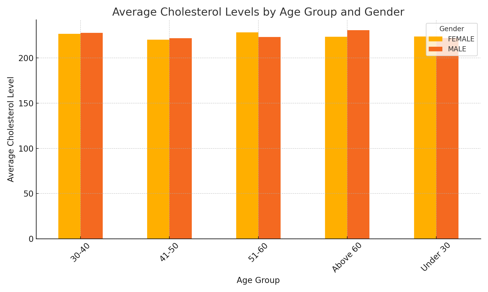
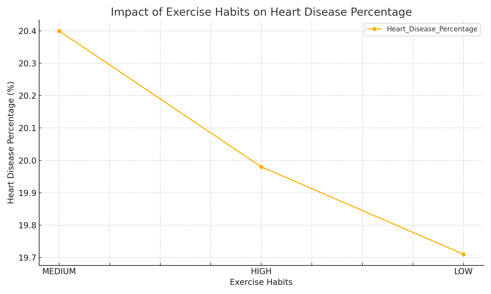
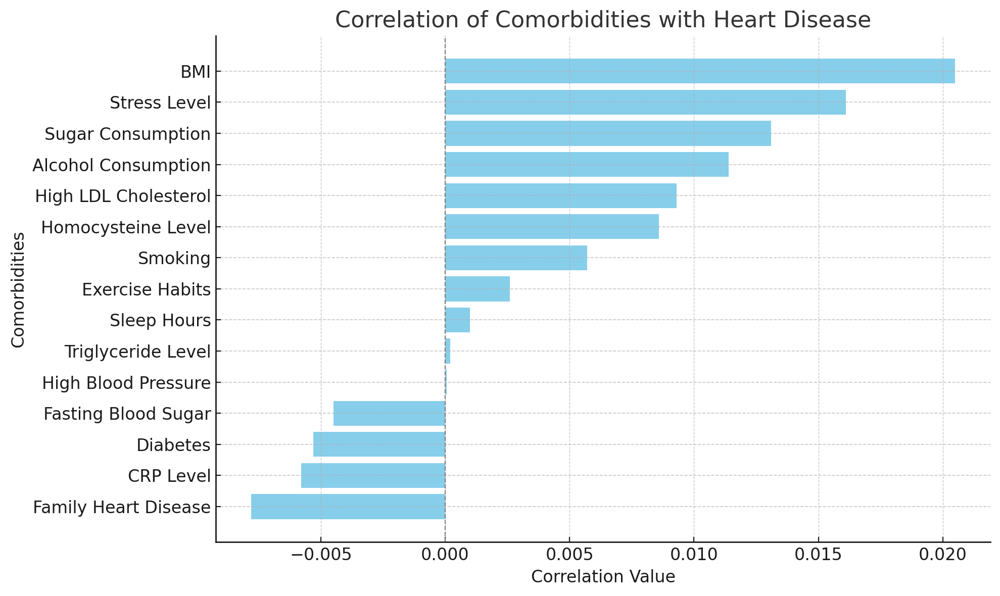

# Heart Disease Analysis

## Tools and Technologies
- **SQL**: Querying and transforming raw data.
- **Excel**: Summarizing and visualizing results.

## Key Skills Demonstrated
- Data querying and aggregation with SQL.
- Data cleaning and preparation for analysis.
- Deriving actionable insights from raw data.
- Presentation of results in a clear, concise format.

## Repository Structure
- **SQL Files**: Located in the root directory and named descriptively.
- **Results Files**: Corresponding `.csv` files containing query outputs.
- **Cleaned Dataset**: Processed file ready for analysis.

## Analysis Reasoning
- It's widely accepted that heart disease is one of the largest threats to the U.S. healthcare system.
- This analysis looks at the most popular comorbidities and analyzes their correlations with heart disease.
- My focus was exercise and cholesterol levels in relation to heart disease, but all factors in the dataset are addressed.


## Project

### 1. **Heart Disease Dataset Cleaning**
- **Cleaned Dataset**: [`heart_disease_cleaned.csv`](./heart_disease_cleaned.csv)
- **Description**: This dataset has been cleaned and prepared for further analysis, ensuring consistency, accuracy, and usability.
- **Source: https://www.kaggle.com/datasets/oktayrdeki/heart-disease
- **Process: Data was cleaned through deletion of duplicates, removal of cells with null or absent data, and removal of impactful outliers.

### 2. **Cholesterol Levels by Age and Gender**
- **SQL Query**:
```sql
SELECT 
    CASE 
        WHEN Age < 30 THEN 'Under 30'
        WHEN Age BETWEEN 30 AND 40 THEN '30-40'
        WHEN Age BETWEEN 41 AND 50 THEN '41-50'
        WHEN Age BETWEEN 51 AND 60 THEN '51-60'
        ELSE 'Above 60'
    END AS Age_Group,
    Gender,
    ROUND(AVG(Cholesterol_Level), 1) AS Avg_Cholesterol
FROM heart_disease_cleaned
WHERE Heart_Disease_Status = 'Yes'
GROUP BY Age_Group, Gender
ORDER BY Age_Group, Gender;
```
- **Results**: [`CholesterolByAge&GenderResults.csv`](./CholesterolByAge%26GenderResults.csv)
- **Visualization**: 
- **Description**: This project explores cholesterol trends by age group and gender, providing insights into population health metrics.

### 3. **Impact of Exercise on Health Metrics**
- **SQL Query**:
```sql
SELECT 
    Exercise_Habits,
    COUNT(CASE WHEN Heart_Disease_Status = 'Yes' THEN 1 END) AS Heart_Disease_Count,
    COUNT(*) AS Total_Count,
    ROUND(COUNT(CASE WHEN Heart_Disease_Status = 'Yes' THEN 1 END) * 100.0 / COUNT(*), 2) AS Heart_Disease_Percentage
FROM heart_disease_cleaned
GROUP BY Exercise_Habits
ORDER BY Heart_Disease_Percentage DESC;
```
- **Results**: [`ExerciseImpactResult.csv`](./ExerciseImpactResult.csv)
- **Visualization**: 
- **Description**: Analyzes the correlation between exercise frequency and key health indicators such as blood pressure, cholesterol, and BMI.

### 4. **Comorbidities Correlation Analysis**
- **SQL Query**:
```sql
WITH Binary_Transform AS (
    SELECT
        CASE WHEN Heart_Disease_Status = 'YES' THEN 1 ELSE 0 END AS Heart_Disease_Binary,
        CASE WHEN Diabetes = 'YES' THEN 1 ELSE 0 END AS Diabetes_Binary,
        CASE WHEN High_Blood_Pressure = 'YES' THEN 1 ELSE 0 END AS High_BP_Binary,
        CASE WHEN High_LDL_Cholesterol = 'YES' THEN 1 ELSE 0 END AS High_LDL_Binary,
        CASE WHEN Smoking = 'YES' THEN 1 ELSE 0 END AS Smoking_Binary,
        CASE WHEN Family_Heart_Disease = 'YES' THEN 1 ELSE 0 END AS Family_Heart_Binary,
        CASE WHEN Exercise_Habits = 'HIGH' THEN 2 
             WHEN Exercise_Habits = 'MEDIUM' THEN 1
             ELSE 0 END AS Exercise_Habits_Score,
        BMI,
        CASE WHEN Alcohol_Consumption = 'HIGH' THEN 2 
             WHEN Alcohol_Consumption = 'MEDIUM' THEN 1
             ELSE 0 END AS Alcohol_Consumption_Score,
        CASE WHEN Stress_Level = 'HIGH' THEN 2 
             WHEN Stress_Level = 'MEDIUM' THEN 1
             ELSE 0 END AS Stress_Level_Score,
        Sleep_Hours,
        CASE WHEN Sugar_Consumption = 'HIGH' THEN 2 
             WHEN Sugar_Consumption = 'MEDIUM' THEN 1
             ELSE 0 END AS Sugar_Consumption_Score,
        Triglyceride_Level,
        Fasting_Blood_Sugar,
        CRP_Level,
        Homocysteine_Level
    FROM heart_disease_cleaned
),
Stats AS (
    SELECT
        AVG(Heart_Disease_Binary) AS Avg_Heart_Disease,
        AVG(Diabetes_Binary) AS Avg_Diabetes,
        AVG(High_BP_Binary) AS Avg_High_BP,
        AVG(High_LDL_Binary) AS Avg_High_LDL,
        AVG(Smoking_Binary) AS Avg_Smoking,
        AVG(Family_Heart_Binary) AS Avg_Family_Heart,
        AVG(Exercise_Habits_Score) AS Avg_Exercise_Habits,
        AVG(BMI) AS Avg_BMI,
        AVG(Alcohol_Consumption_Score) AS Avg_Alcohol_Consumption,
        AVG(Stress_Level_Score) AS Avg_Stress_Level,
        AVG(Sleep_Hours) AS Avg_Sleep_Hours,
        AVG(Sugar_Consumption_Score) AS Avg_Sugar_Consumption,
        AVG(Triglyceride_Level) AS Avg_Triglyceride_Level,
        AVG(Fasting_Blood_Sugar) AS Avg_Fasting_Blood_Sugar,
        AVG(CRP_Level) AS Avg_CRP_Level,
        AVG(Homocysteine_Level) AS Avg_Homocysteine_Level
    FROM Binary_Transform
)
SELECT
    'Diabetes' AS Comorbidity,
    SUM((Heart_Disease_Binary - Stats.Avg_Heart_Disease) *
        (Diabetes_Binary - Stats.Avg_Diabetes)) /
    SQRT(SUM(POWER(Heart_Disease_Binary - Stats.Avg_Heart_Disease, 2)) *
         SUM(POWER(Diabetes_Binary - Stats.Avg_Diabetes, 2))) AS Correlation_Value
FROM Binary_Transform, Stats

UNION ALL

SELECT
    'High_Blood_Pressure' AS Comorbidity,
    SUM((Heart_Disease_Binary - Stats.Avg_Heart_Disease) *
        (High_BP_Binary - Stats.Avg_High_BP)) /
    SQRT(SUM(POWER(Heart_Disease_Binary - Stats.Avg_Heart_Disease, 2)) *
         SUM(POWER(High_BP_Binary - Stats.Avg_High_BP, 2))) AS Correlation_Value
FROM Binary_Transform, Stats

UNION ALL

SELECT
    'High_LDL_Cholesterol' AS Comorbidity,
    SUM((Heart_Disease_Binary - Stats.Avg_Heart_Disease) *
        (High_LDL_Binary - Stats.Avg_High_LDL)) /
    SQRT(SUM(POWER(Heart_Disease_Binary - Stats.Avg_Heart_Disease, 2)) *
         SUM(POWER(High_LDL_Binary - Stats.Avg_High_LDL, 2))) AS Correlation_Value
FROM Binary_Transform, Stats

UNION ALL

SELECT
    'Smoking' AS Comorbidity,
    SUM((Heart_Disease_Binary - Stats.Avg_Heart_Disease) *
        (Smoking_Binary - Stats.Avg_Smoking)) /
    SQRT(SUM(POWER(Heart_Disease_Binary - Stats.Avg_Heart_Disease, 2)) *
         SUM(POWER(Smoking_Binary - Stats.Avg_Smoking, 2))) AS Correlation_Value
FROM Binary_Transform, Stats

UNION ALL

SELECT
    'Family_Heart_Disease' AS Comorbidity,
    SUM((Heart_Disease_Binary - Stats.Avg_Heart_Disease) *
        (Family_Heart_Binary - Stats.Avg_Family_Heart)) /
    SQRT(SUM(POWER(Heart_Disease_Binary - Stats.Avg_Heart_Disease, 2)) *
         SUM(POWER(Family_Heart_Binary - Stats.Avg_Family_Heart, 2))) AS Correlation_Value
FROM Binary_Transform, Stats

UNION ALL

SELECT
    'Exercise_Habits' AS Comorbidity,
    SUM((Heart_Disease_Binary - Stats.Avg_Heart_Disease) *
        (Exercise_Habits_Score - Stats.Avg_Exercise_Habits)) /
    SQRT(SUM(POWER(Heart_Disease_Binary - Stats.Avg_Heart_Disease, 2)) *
         SUM(POWER(Exercise_Habits_Score - Stats.Avg_Exercise_Habits, 2))) AS Correlation_Value
FROM Binary_Transform, Stats

UNION ALL

SELECT
    'BMI' AS Comorbidity,
    SUM((Heart_Disease_Binary - Stats.Avg_Heart_Disease) *
        (BMI - Stats.Avg_BMI)) /
    SQRT(SUM(POWER(Heart_Disease_Binary - Stats.Avg_Heart_Disease, 2)) *
         SUM(POWER(BMI - Stats.Avg_BMI, 2))) AS Correlation_Value
FROM Binary_Transform, Stats

UNION ALL

SELECT
    'Alcohol_Consumption' AS Comorbidity,
    SUM((Heart_Disease_Binary - Stats.Avg_Heart_Disease) *
        (Alcohol_Consumption_Score - Stats.Avg_Alcohol_Consumption)) /
    SQRT(SUM(POWER(Heart_Disease_Binary - Stats.Avg_Heart_Disease, 2)) *
         SUM(POWER(Alcohol_Consumption_Score - Stats.Avg_Alcohol_Consumption, 2))) AS Correlation_Value
FROM Binary_Transform, Stats

UNION ALL

SELECT
    'Stress_Level' AS Comorbidity,
    SUM((Heart_Disease_Binary - Stats.Avg_Heart_Disease) *
        (Stress_Level_Score - Stats.Avg_Stress_Level)) /
    SQRT(SUM(POWER(Heart_Disease_Binary - Stats.Avg_Heart_Disease, 2)) *
         SUM(POWER(Stress_Level_Score - Stats.Avg_Stress_Level, 2))) AS Correlation_Value
FROM Binary_Transform, Stats

UNION ALL

SELECT
    'Sleep_Hours' AS Comorbidity,
    SUM((Heart_Disease_Binary - Stats.Avg_Heart_Disease) *
        (Sleep_Hours - Stats.Avg_Sleep_Hours)) /
    SQRT(SUM(POWER(Heart_Disease_Binary - Stats.Avg_Heart_Disease, 2)) *
         SUM(POWER(Sleep_Hours - Stats.Avg_Sleep_Hours, 2))) AS Correlation_Value
FROM Binary_Transform, Stats

UNION ALL

SELECT
    'Sugar_Consumption' AS Comorbidity,
    SUM((Heart_Disease_Binary - Stats.Avg_Heart_Disease) *
        (Sugar_Consumption_Score - Stats.Avg_Sugar_Consumption)) /
    SQRT(SUM(POWER(Heart_Disease_Binary - Stats.Avg_Heart_Disease, 2)) *
         SUM(POWER(Sugar_Consumption_Score - Stats.Avg_Sugar_Consumption, 2))) AS Correlation_Value
FROM Binary_Transform, Stats

UNION ALL

SELECT
    'Triglyceride_Level' AS Comorbidity,
    SUM((Heart_Disease_Binary - Stats.Avg_Heart_Disease) *
        (Triglyceride_Level - Stats.Avg_Triglyceride_Level)) /
    SQRT(SUM(POWER(Heart_Disease_Binary - Stats.Avg_Heart_Disease, 2)) *
         SUM(POWER(Triglyceride_Level - Stats.Avg_Triglyceride_Level, 2))) AS Correlation_Value
FROM Binary_Transform, Stats

UNION ALL

SELECT
    'Fasting_Blood_Sugar' AS Comorbidity,
    SUM((Heart_Disease_Binary - Stats.Avg_Heart_Disease) *
        (Fasting_Blood_Sugar - Stats.Avg_Fasting_Blood_Sugar)) /
    SQRT(SUM(POWER(Heart_Disease_Binary - Stats.Avg_Heart_Disease, 2)) *
         SUM(POWER(Fasting_Blood_Sugar - Stats.Avg_Fasting_Blood_Sugar, 2))) AS Correlation_Value
FROM Binary_Transform, Stats

UNION ALL

SELECT
    'CRP_Level' AS Comorbidity,
    SUM((Heart_Disease_Binary - Stats.Avg_Heart_Disease) *
        (CRP_Level - Stats.Avg_CRP_Level)) /
    SQRT(SUM(POWER(Heart_Disease_Binary - Stats.Avg_Heart_Disease, 2)) *
         SUM(POWER(CRP_Level - Stats.Avg_CRP_Level, 2))) AS Correlation_Value
FROM Binary_Transform, Stats

UNION ALL

SELECT
    'Homocysteine_Level' AS Comorbidity,
    SUM((Heart_Disease_Binary - Stats.Avg_Heart_Disease) *
        (Homocysteine_Level - Stats.Avg_Homocysteine_Level)) /
    SQRT(SUM(POWER(Heart_Disease_Binary - Stats.Avg_Heart_Disease, 2)) *
         SUM(POWER(Homocysteine_Level - Stats.Avg_Homocysteine_Level, 2))) AS Correlation_Value
FROM Binary_Transform, Stats

ORDER BY Correlation_Value DESC;
```
- **Results**: [`Comorbidities_Correlation_Results.csv`](./Comorbidities_Correlation_Results.csv)
- **Visualization**: 
- - **Description**: This project investigates correlations between various comorbidities (e.g., hypertension, diabetes, and cholesterol) and their collective impact on health outcomes. It provides insights into how these conditions coexist and influence each other, helping to identify critical areas for public health intervention.
 


## Final Thoughts and Recommendations
- After finishing the SQL work and diving into the results, a couple things become clear. The factors with the largest positive correlation to heart disease are BMI, Stress Level and Sugar Consumption. This makes sense and is in line with current public health recommendations and reinforces an accurate analysis. However, a couple things are potentially counter-intuitive. The most interesting of which is the very weak link between increased physical activity levels and heart disease. The results are indicating either a lack of strong linear relationships or data quality/sampling issues.
